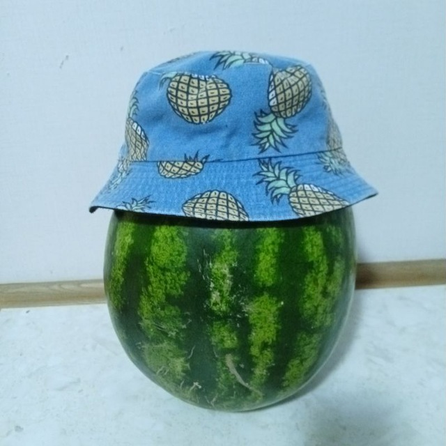

# README for KaG9S 

Well dis fakas file is created as a readme file for [my profile on github](https://github.com/KaG9S).

## My works (on github or not)

- [nmbrz](https://github.com/KaG9S/nmbrz) - more accurate calculations for python. also breaking python limits
- [nmbrz-gui](https://github.com/KaG9S/nmbrz-gui) - calculator with nmbrz as base
- [OpenspaceOS](https://github.com/OpenspaceOS) - **future** OS (based on linux) for servers, codebases, and virtual machines.
- [UPM](https://github.com/OpenspaceOS/upm) - cool package manager, and main one for OpenspaceOS.
- [psich_bot](https://github.com/KaG9S/psich_bot) - template project for telegram bot. read readme for more

## Contact

> \[!NOTE]
> At most, my nickname in socials is KaG9S, but there are excludes. They've listed below as well

- [Telegram](https://t.me/KaG9S) and [tg bio](https://t.me/sudo_opsec)
- gmail - kkntevest@gmail.com
- Discord - KaG9S
- [TikTok](https://www.tiktok.com/@kag9s)

## Communities i am related to

- [OpenspaceOS project](https://github.com/OpenspaceOS)
- [Aksol team](https://www.tiktok.com/@aksolteam)

### Langs that i learn
- PYTHON
- HTML/CSS/JS
- C/C++ (LOW)

### My main OS
- [Arch Linux](https://archlinux.org) (HP ProBook 6360b)
- [Rasberry Pi Os](https://www.raspberrypi.com/software/operating-systems/) Lite (Linux dist.) (PaspberryPi 3B+)
- Android ([OneUI](https://www.samsung.com/uk/one-ui/)) (Samsung Galaxy A15)

---
# end
why did u read this shii
